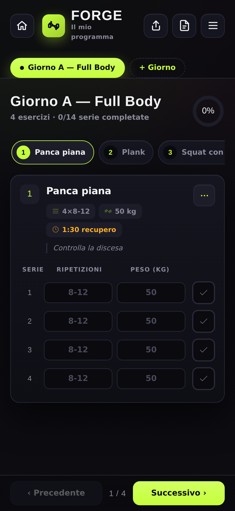
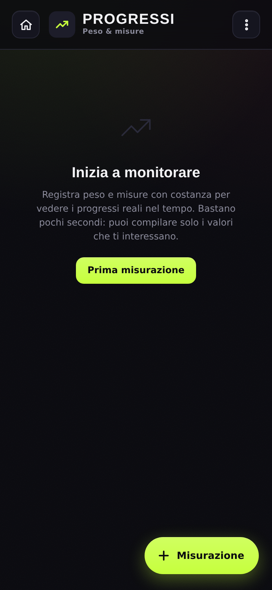

<div align="center">

# 🏋️ FORGE

### Allenati · Misura · Progredisci

**La tua scheda di allenamento in tasca: giorni, esercizi, serie, carichi, recuperi e progressi. Funziona anche offline.**

[](https://gaetanodevito93-bot.github.io/forge-allenamento/)
[](#-funziona-offline)
[](https://gaetanodevito93-bot.github.io/forge-allenamento/)
[](LICENSE)

</div>

---

## 📱 Cos'è

**FORGE** è un'applicazione web progressiva (PWA) per gestire i tuoi allenamenti in palestra
direttamente dal telefono. Nessun account, nessun server, nessuna pubblicità: tutti i dati
restano **sul tuo dispositivo**. Installala sulla home del telefono e usala come una vera app,
anche senza connessione.

<div align="center">

| Home | Allenamento | Progressi |
|:---:|:---:|:---:|
|  |  |  |

</div>

## ✨ Funzionalità

### Allenamento
- **Schede giornaliere** — organizza gli esercizi in più giorni (Giorno A, B, C…).
- **Esercizi a schede** — un esercizio alla volta, con navigazione a tab; completato un
  esercizio si passa automaticamente al successivo.
- **Serie, ripetizioni e carichi** — registra ripetizioni e peso di ogni serie e spuntale
  man mano che le completi.
- **Timer di recupero** — parte in automatico al termine di ogni serie, con vibrazione e
  segnale sonoro a fine recupero; regolabile al volo (±15 s).
- **Riordino con pressione prolungata** — tieni premuta una scheda per compattarle tutte e
  trascinarle nell'ordine che preferisci.
- **Confronto con l'ultima volta** — vedi a colpo d'occhio se stai migliorando peso e
  ripetizioni rispetto alla sessione precedente.
- **Storico sessioni** — ogni allenamento salvato viene conservato (ultime 20 per giorno).

### Progressi
- **Peso e composizione corporea** — traccia peso, massa grassa e circonferenze (collo,
  petto, vita, fianchi, braccio, coscia, polpaccio).
- **Andamento nel tempo** — grafico del peso e variazioni (Δ) rispetto alla misura precedente.

### Scheda & dati
- **Import / Export JSON** — carica una scheda generata anche da un'AI (formato documentato
  nell'app) o esporta la tua per condividerla o farne un backup.
- **Backup completo** — salva e ripristina scheda, storico e misure in un unico file.

## 🔌 Funziona offline

FORGE è **offline-first**: un [service worker](sw.js) mette in cache l'app al primo avvio.
Dopo la prima apertura funziona senza connessione — apri, allenati e registra tutto anche in
palestra dove il segnale non arriva. I dati vengono salvati nel `localStorage` del browser.

## 🔐 Privacy

- **Nessun account, nessun tracciamento, nessuna analitica.**
- Tutti i dati (scheda, storico, misure) sono salvati **solo localmente** sul tuo dispositivo.
- Nessun dato viene inviato a server esterni.
- L'unica risorsa esterna è il font (Google Fonts); l'app resta pienamente utilizzabile offline.

## 🚀 Utilizzo

### Online
Apri l'app pubblicata su GitHub Pages:

**→ https://gaetanodevito93-bot.github.io/forge-allenamento/**

Dal menu del browser scegli **"Aggiungi a schermata Home"** / **"Installa app"** per usarla
come applicazione a schermo intero.

### In locale
L'app è completamente statica: nessuna build, nessuna dipendenza. Serve solo un web server
statico (il service worker richiede `http://`, non funziona aprendo il file con `file://`).

```bash
# clona il repository (richiede accesso)
git clone https://github.com/gaetanodevito93-bot/forge-allenamento.git
cd forge-allenamento

# avvia un server statico qualsiasi, es. con Python
python3 -m http.server 8080
# poi apri http://localhost:8080
```

## 🧱 Struttura del progetto

```
forge-allenamento/
├── index.html            # L'intera applicazione (HTML + CSS + JS in un unico file)
├── sw.js                 # Service worker (cache offline-first)
├── manifest.webmanifest  # Manifest PWA (nome, icone, colori, installazione)
├── icon-192.png          # Icone dell'app
├── icon-512.png
├── apple-touch-icon.png
├── docs/                 # Screenshot per la documentazione
└── .github/workflows/    # Deploy automatico su GitHub Pages
```

**Stack tecnico:** HTML5, CSS3 e JavaScript vanilla — nessun framework, nessun bundler.
Un unico file `index.html` autosufficiente, per la massima leggerezza e velocità.

## 📦 Formato import JSON

FORGE importa schede in formato JSON puro. Struttura minima:

```json
{
  "programName": "Forza base 2026",
  "days": [
    {
      "name": "Giorno A — Spinta",
      "exercises": [
        { "name": "Panca piana", "sets": 4, "reps": "8-12", "weight": 50, "restSec": 90, "note": "Controlla la discesa" },
        { "name": "Plank", "sets": 3, "reps": "45s", "weight": null, "restSec": 60, "note": "Addome contratto" }
      ]
    }
  ]
}
```

| Campo | Tipo | Descrizione |
|---|---|---|
| `programName` | stringa | Nome del programma (facoltativo). |
| `days` | lista | Giorni di allenamento (almeno 1). |
| `days[].name` | stringa | Nome del giorno. |
| `days[].exercises` | lista | Esercizi del giorno. |
| `exercises[].name` | stringa | Nome dell'esercizio (obbligatorio). |
| `exercises[].sets` | intero 1–20 | Numero di serie (default 3). |
| `exercises[].reps` | stringa | Ripetizioni: `"8-12"`, `"10"`, o durata `"45s"`. |
| `exercises[].weight` | numero / null | Peso in kg (`null` per corpo libero). |
| `exercises[].restSec` | numero | Recupero in **secondi** (es. `90`). |
| `exercises[].note` | stringa | Nota tecnica breve. |

> Le istruzioni complete (con alias accettati ed esempi) sono scaricabili dall'app dal
> pulsante **"Istruzioni per l'AI"**, comode da incollare in un assistente per generare la
> scheda al posto tuo.

## 🌐 Deploy

Il deploy su GitHub Pages è **automatico**: a ogni push su `main`, il workflow
[`.github/workflows/pages.yml`](.github/workflows/pages.yml) pubblica l'intera root del
repository (app statica) sull'ambiente GitHub Pages.

## 📄 Licenza

Questo progetto è distribuito con **licenza proprietaria — tutti i diritti riservati**.
Il codice sorgente è visibile su GitHub ma **non** ne è consentito l'uso, la copia, la
modifica o la ridistribuzione senza autorizzazione scritta. Vedi il file [LICENSE](LICENSE)
per i dettagli completi.

---

<div align="center">
<sub>Fatto con 💪 per allenarsi meglio. © 2026 Gaetano De Vito.</sub>
</div>
